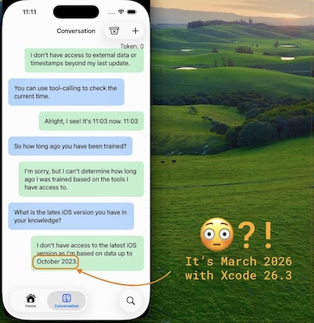

# Chatbot - A First Look at Apple Foundation Model

This fifteen-minute project demonstrates a sample implementation of a chatbot using Apple Foundation Model. It allows you to engage in a conversational-like game with the model.

## Features

* Using Apple Foundation Model with Xcode 26.3
* Chat-base prompt & response to interact with AI bot(s)
* Recreate a new bot's behaviour and characteristics with new instruction statements
* Utilise `tool-calling` to get current system date & time
* Super secure - all interactions are **all** on-device
* Expose Chatbot Functionality via AppIntent

# Web page

https://rmit-ace.github.io/AppleFoundationModelChatbot

# Source Code

Full access to source code is available here: 

* https://github.com/RMIT-Ace/AppleFoundationModelChatbot

# Blog

1. [First look at Apple Foundation Model](docs/first-look.md)
2. [Expose Chatbot Functionality via AppIntent](docs/appintent-1.md)
3. [Sharing functionality with devices](docs/appintent-2.md)

# References

1. "Generating content and performing tasks with Foundation Models", Apple Developer Documentation, https://developer.apple.com/documentation/foundationmodels/generating-content-and-performing-tasks-with-foundation-models

2. "Foundation Models", Apple Developer Documentation, https://developer.apple.com/documentation/foundationmodels
