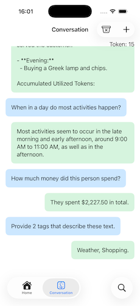
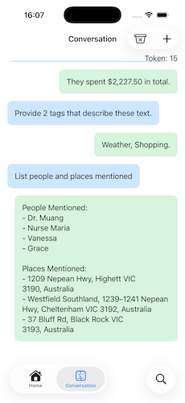

# Chatbot - A First Look at Apple Foundation Model


This fifteen-minute project demonstrates a sample implementation of a chatbot using Apple Foundation Model. It allows you to engage in a conversational-like game with the model.

## Features

* Using Apple Foundation Model with Xcode 26.3
* Chat-base prompt & response to interact with AI bot(s)
* Recreate a new bot's behaviour and characteristics with new instruction statements
* Utilise `tool-calling` to get current system date & time
* Super secure - all interactions are **all** on-device


```swift
var instruction: String = 
"""
You are my best buddy who like to make jokes.
Give each answer short within 2 to 3 lines.
Append the number of accumulated utilised tokens (X) for the current session at the end of each 
new line using this format [token: X]
"""
```
# Sample Usages

What it is good for:

| Capability | Prompt example |
| ---------- | -------------- |
| Summarize | "Summary the given text" |
| Extract entities | "List the people and places mentioned in this text" |
| Understand text | "What happens to the dog in this story" |
| Refine or edit text | "Change this story to be in second person" |
| Classify or judge text | "Is this text relevant to the topic 'Swift'?" |
| Compose creative writing | "Generate a short bedtime story about a fox" |
| Generate tags from text | "Provide two tags that describe the given text" |
| Generate game dialog | "Respond in the void of a friendly inn keeper" |

(Note: Taken from "Generating content and performing tasks with Foundation Models", Apple Developer Documentation, see Reference 1 below)

I simply copied and pasted a section of my journal into the app and ended up having a fantastic hour-long conversation with the bot!  It was amazing!

| Sample 1 | Sample 2 |
| --- | --- |
|  |  |

# References

1. "Generating content and performing tasks with Foundation Models", Apple Developer Documentation, https://developer.apple.com/documentation/foundationmodels/generating-content-and-performing-tasks-with-foundation-models

2. "Foundation Models", Apple Developer Documentation, https://developer.apple.com/documentation/foundationmodels
