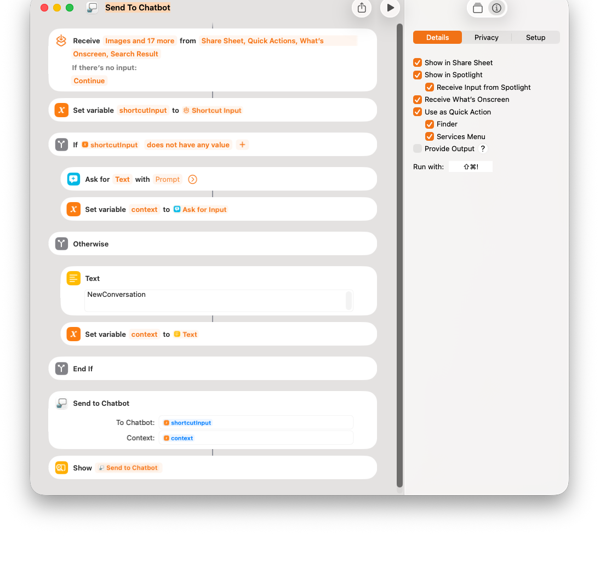

# Sharing functionality with devices

[](https://www.youtube.com/watch?v=9k3fZX2KhuI)

# Update AppIntent

```swift
import SwiftUI
import AppIntents

struct SendToChatbotIntent: AppIntent {

    static let title: LocalizedStringResource = "Send to Chatbot"
    
    static let description = IntentDescription("Testing")
    
    static let openAppWhenRun: Bool = false
    
    @Parameter(title: "To Chatbot", requestValueDialog: "What to send?")
    var target: String

    @Parameter(title: "Context", requestValueDialog: "Provide context (optional)")
    var context: String
    
    @MainActor
    func perform() async throws -> some IntentResult & ReturnsValue<String> {
        if context == "NewConversation" {
            AppleFoundationModelViewModel.shared.resetSession()
        }
        let combinedPrompt = context.isEmpty ? target : "\(target)\nContext: \(context)"
        let answer = await AppleFoundationModelViewModel.shared.ask(prompt: combinedPrompt) ?? "No response"
        return .result(value: answer)
    }
}
```

Modification to our `SendToChatbotIntent` from the previous post:

* Our app-intent now expects to receive 2 inputs: 
    1) the prompt to our Chatbot; and 
    2) the context of the conversation.

* The conversation with chatbot continue. This allows you to send more queries to chatbot regard the most recent input

* We start a new conversation when sending new input the chatbot. This is done by setting `context` to `NewConversatin`.


# Apple Shortcuts



# Source Code

You can find project source code here:

https://github.com/RMIT-Ace/AppleFoundationModelChatbot
