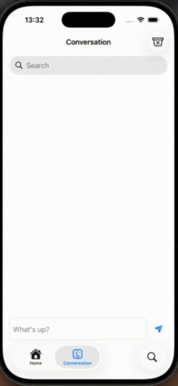

# Dynamic height text editor



This week, we’re improving our chatbot’s functionality by creating a more user-friendly input text field.  This involves increasing the height of the input field to accommodate multiple lines of text.

```swift
ZStack(alignment: .topLeading) {
    if prompt.isEmpty { // (1)
        Text("What's up?")
            .foregroundColor(.secondary)
            .padding(.horizontal, 8)
            .padding(.top, 16)
            .allowsHitTesting(false)
    }
    
    TextEditor(text: $prompt)   // (2)
        .focused($isTextFieldFocused)
        .frame(height: max(42, min(textEditorHeight, 200))) // (3)
        .scrollContentBackground(.hidden)
        .padding(.horizontal, 4)
        .padding(.top, 8)
        .overlay( // (4) 
            // Hidden text to measure actual rendered height including wrapping
            GeometryReader { outerGeometry in // (5)
                Text(prompt.isEmpty ? " " : prompt)
                    .font(.body)
                    .padding(.horizontal, 8)
                    .padding(.vertical, 8)
                    .frame(width: outerGeometry.size.width, alignment: .leading) // (6)
                    .fixedSize(horizontal: false, vertical: true)
                    .background(
                        GeometryReader { geometry in // (7)
                            Color.clear.preference(
                                key: TextHeightPreferenceKey.self,
                                value: geometry.size.height
                            )
                        }
                    )
                    .opacity(0)
            }
        )
}
.background(editorBackground)
.onPreferenceChange(TextHeightPreferenceKey.self) { height in // (8)
    textEditorHeight = height
}

```

# Explanation

(1) This displays a placeholder text "What's up" when the input is empty.

(2) We use `TextEditor` to implement this text input field.

(3) The dynamic height for our field is controlled by manipulating `textEditorHeight`. So on the top of the file you should declare this as a state variable.

```@State private var textEditorHeight: CGFloat = 42```

(4) We add our height observation code to our `TextEditor` as an overlay of the view.

(5 & 6) We use `GeometryReader` to find the size of our textfield at runtime.

(7) This is where we place our height (preference) observer code.  We implemented it as an invisible background and set this preference to the key `TextHeightPreferenceKey` defined further down the file.

```swift
struct TextHeightPreferenceKey: PreferenceKey {
    static var defaultValue: CGFloat = 42
    static func reduce(value: inout CGFloat, nextValue: () -> CGFloat) {
        value = nextValue()
    }
}
```

(8) When change occur, we update our dynamic height `textEditorHeight` here.

```swift
.onPreferenceChange(TextHeightPreferenceKey.self) { height in // (8)
    textEditorHeight = height
}
```

# Source Code

You can find project source code here:

https://github.com/RMIT-Ace/AppleFoundationModelChatbot